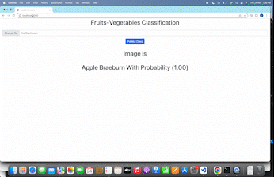

# Fruit-Vegetable Classification Application using CNN and Flask to serve the Rest API
 <br />
<br />





# steps
1. clone the repositiory or download it
2. install the dependencies included in the requirements.ipynb file
3. run python sever.py command to start the flask server
4. The server will start at http://127.0.0.1:3000 url
5. Navigate to the url and try it out.


To start docker container
==========================
```
docker run -it -v C:\Code\dmproject:/dmproject -p 8601:8601 --entrypoint /bin/bash tensorflow/serving
```

To serve only latest model
===========================
```
tensorflow_model_server --rest_api_port=8601 --model_name=fruits_model --model_base_path=/dmproject/saved_models/
```

To serve models using model config file
========================================
```
tensorflow_model_server --rest_api_port=8601  --allow_version_labels_for_unavailable_models --model_config_file=/dmproject/model.config.c
```


Postman commands
=================

To call by versions
```
http://localhost:8601/v1/models/fruits_model/versions/2:predict
```

To call by labels
```
http://localhost:8601/v1/models/fruits_model/labels/beta:predict
```

Body: raw
```
{
    "instances": [
       
    ]
}
```

TF Serving Installation Instructions & Config File Help
=======================================================

https://www.tensorflow.org/tfx/serving/docker
https://www.tensorflow.org/tfx/serving/serving_config